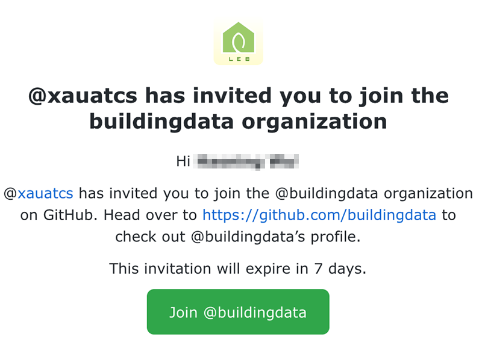
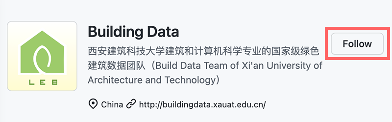

 
 <h2 align="center">新同学手册</h2>
 
关于一些新同学的一些账户设置和福利

  
  
  

### ⭐️ Github 账户

非常欢迎新同学们的加入。新来的小伙伴们需要准备一些账号：

- 自己的 Github 账户（[点击这里申请加入数据组](https://github.com/buildingdata/Welcome/issues/new/choose)）
- 一个 XAUAT 的教育邮箱（[点击这里申请开通](https://github.com/buildingdata/SignUp/issues/new/choose)）
- ~~一个小组网盘账号（暂未开通）~~
- ~~一个 Wiki 知识库账号（暂未开通）~~

### 🎉 加入数据组

准备好 Github 账户后，就可以联系我们加入数据组 Building Data 了！

#### 1.加入

我们会给你发一封邮件，点击 Github 邮件的链接后，即可加入到我们数据组中。

加入成功后，请自己 clone 此 repo，然后再 `README.md` 的表格中，添加自己的姓名（或仅名字）以及 Github 账号的链接，完成后进行 push 操作。之后，你的头像就会出现在小组列表之中。

#### 2.被关注

我们的管理者会用 [xauatcs](https://github.com/xauatcs) 关注你的 Github 账户，还能帮你涨一个小粉丝呢！如果有需要还可以帮助你点点项目的 ⭐️ Star 。

#### 3.关注数据组的动态

最后别忘了关注一下动态哦：

### ✉️ 教育邮箱

拿到教育邮箱后的小伙伴们，就可以申请一些教育授权了：

#### 学术类：

|        名称        |           教育版           |
| :----------------: | :------------------------: |
|       Github       |          学生优惠          |
| Microsoft Onedrive | 免费的 5T 的 OneDrive 账户 |
|  Microsoft Office  |  Office 365 的教育子账户   |
|       Google       |   G Sutie Drive无限容量    |
|  Jetbrains 全家桶  |       一年免费使用权       |
|       亚马逊       |       AWS 免费服务器       |
|     有道云翻译     |          免费使用          |
|        ...         |            ...             |

#### 其他类：

|     名称     |       教育版       |
| :----------: | :----------------: |
| Apple Music  |      学生优惠      |
| Adobe 全家桶 | 便宜一半的订阅价格 |
|     ...      |        ...         |
