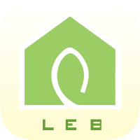

 
 <h2 align="center">Building Data</h2>
 
西安建筑科技大学“零能零碳”建筑数团队数据小组

  
  
  

### 👋 欢迎

首先，非常欢迎新同学加入到西安建筑科技大学 “零能零碳” 建筑数团队数据小组之中，未来一段时间，我们将相互学习和帮助，在绿色建筑和建筑节能的研究反向上，进行一些 “小小的突破“。

我们是一个国家及团队，研究方向是 “建筑技术科学学科与计算机信息科学交叉融合”，是个新事物，新方向。我们大家一起商量商量、琢磨琢磨，看看如何能探索出一条培养路径和新的研究方向。为大家的成长进步做好服务。希望大家畅所欲言，开心交流。

### 📚 这里有什么？

这里是我们数据团队的代码开发和托管平台，在 git 和 svn 中我们最后选择了 git 工具和 Github 平台。欢迎新同学们一起加入到我们建筑节能数据平台的开发和研究中来。

这里会同步和维护一些我们常用的代码、工具和开发项目等：

- 常用的栅格数据脚本，数据转换工具等
- 建筑节能数字平台的开发和维护
- 建筑节能计算方法和计算代码
- 常用软件的分享和教程以及“踩坑经验”
- 团队的 Wiki 知识库和 “踩坑经验”
- ......

更多内容，等你来探索和添砖加瓦。

	

### 😶 数据团队

#### 1.团队成员

| 入学年份 | 是否管理 |              Github 账户               |      |
| :------: | :------: | :------------------------------------: | :--: |
|   永久   |   永久   | [xauatcs](https://github.com/xauatcs)  |      |
| 2022 级  |    是    | [昊宁](https://github.com/pudding0503) |[李丙鹏](https://github.com/lbp21375) |
| 2023 级  |    否    |                                        |      |

> 📣 请新入学的同学们自行 Clone 此 repo，然后在相应位置填入自己的姓名（或者仅名字）以及自己的 Github 账户首页链接，完成后进行 push 操作。

一旦你完成 push 后，下方的成员图里面就会出现你的账号头像：

#### 2.团队接力棒

团队接力棒交接时间在暑假期间（下次交接时间在 2024 年暑假期间）：

- 升学到研三的同学，将让出此组织的管理权
- 升学到研二的同学，将拿起接力棒，管理好此组织
- 准备入学的准研一同学此时也会加入进来，提早熟悉

权限设置：

|    类别    | 给予权限  |
| :--------: | :-------: |
|    研三    |  Member   |
|  **研二**  | **Owner** |
| （准）研一 |  Member   |
|   毕业生   |  Member   |

毕业后的同学，请继续保持他们的成员身份，可以利于后期交流和为自己的 Github 添加履历。

#### 3.新同学手册

欢迎新同学，没事的话可以看下[《新同学手册》](Handbook.md)：

里面有一些步骤信息、申请信息和福利信息等。

### 📐 开发规则

在参与开发之前，也一定一定看一下咱们的[《开发手册》](Devbook.md)：

可以有效的统一开发开发规范，减少合并冲突等。
